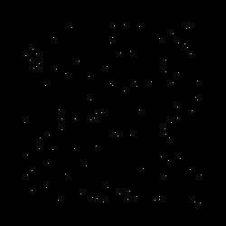
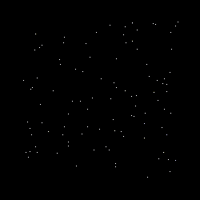
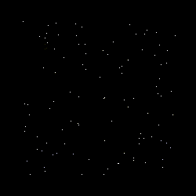

# boids
A simple 2d boids simulation given to students as [subject](http://webia.lip6.fr/~chenm/Teaching/2016/2I002/TMEsolo/boids.html) (in French) of an exam in an Object-Oriented Programming course.

